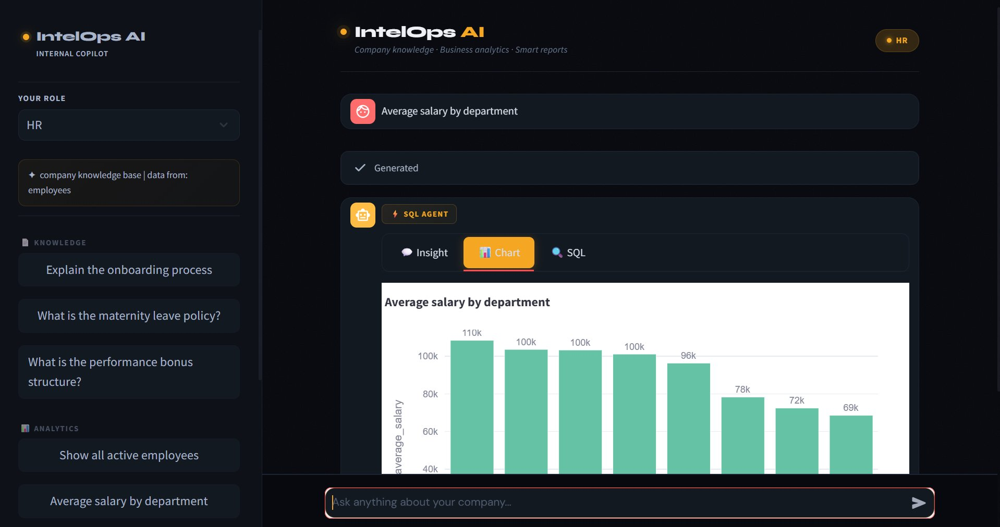
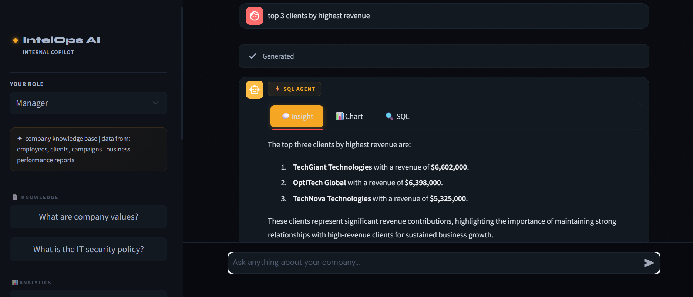
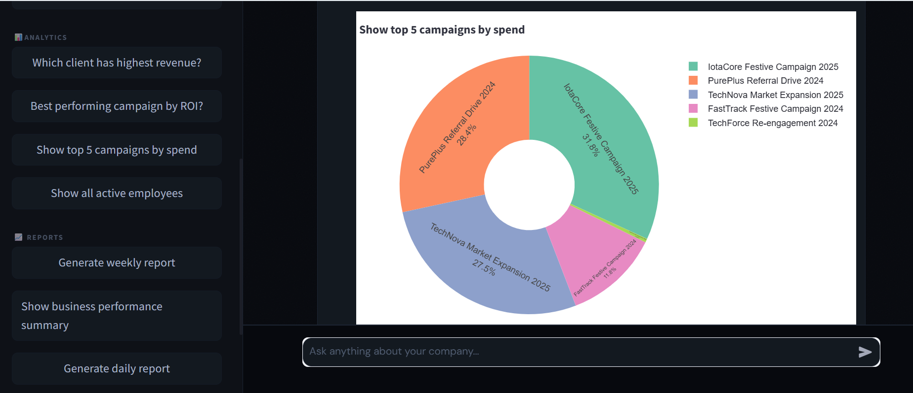
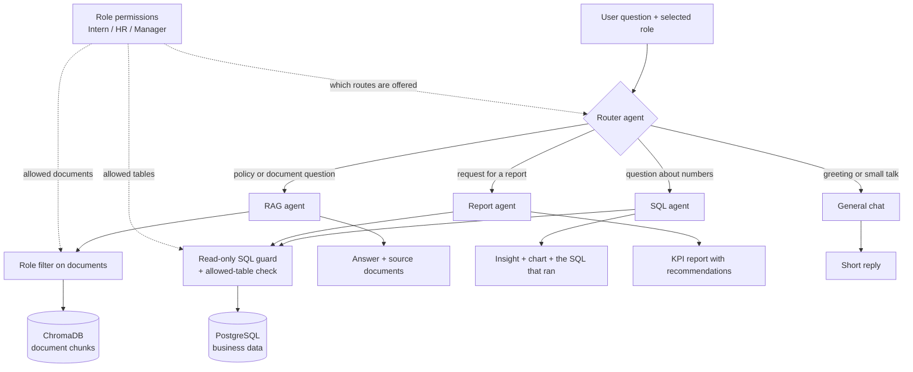

# IntelOps AI

An internal company copilot. Staff ask a question in plain English and get an answer from the right
place: company documents, the business database, or a generated performance report. What each person
can reach depends on their role.

**Live demo:** https://intelopsai.streamlit.app/

Built at Eligent AI. The source code is private; I'm happy to walk through it in an interview.

## The problem

In most companies, answers live in two different places. Policies and procedures sit in PDFs that nobody
searches well. Numbers sit in a database that only people who write SQL can query. A new intern asking
about leave policy and a manager asking which campaign earned the most both end up waiting on someone
else.

IntelOps AI puts one chat box in front of both. It decides where the answer lives, fetches it, and shows
where it came from. It also makes sure an intern can't pull salary data just by asking for it.

## Screenshots

All data shown is fictional sample data.

**A data question as HR.** The SQL agent answers "Average salary by department" and draws the chart. The
role panel on the left shows HR can reach company documents and employee data only.

**A data question as Manager.** The same agent answers a client revenue question in plain English. This
role can also reach client and campaign data and business reports.

**A chart picked automatically.** A result with five rows is drawn as a pie chart.

## Architecture

Each question goes to exactly one agent. The report agent is its own route: it queries the database
itself and does not run after the RAG or SQL agent.

## Components

**Router agent.** Reads the question and the user's role and picks one of four routes. It is a language
model call, not keyword matching, and it is only offered the routes that role is allowed to use.

**RAG agent.** Answers policy and procedure questions from company documents. It must search the
knowledge base before answering, answers only from what it retrieved, and says so when the documents
don't contain the answer. The sources shown under an answer come from the retrieved chunks, not from the
model's own text.

**Document store (ChromaDB).** Five company documents are split into overlapping chunks, embedded and
stored once by an offline ingestion step. A search fetches extra candidates, drops any the role may not
see, and keeps the top five.

**SQL agent.** Turns a question about numbers into a PostgreSQL query. It first looks up the schema of the
tables this role may see, writes the query, runs it, and summarises the result as a short business
insight. The answer has three tabs: the insight, a chart, and the exact SQL that ran.

**SQL guard.** Every query from the SQL and report agents passes through one database layer. It accepts
only read queries, rejects any that name a table outside the role's list, runs them in a read-only
transaction and caps the rows returned.

**Chart builder.** Picks a chart from the shape of the result: a line chart when the label
column is named like a date, a pie chart for five rows or fewer, and a bar chart otherwise.

**Report agent.** Managers can ask for a business performance report. The agent runs several KPI queries
(revenue, top client, campaign return, headcount) and writes them up with three recommendations.

**Role permissions.** One small table of rules defines what Intern, HR and Manager can do. Everything else
reads from it.

| | Intern | HR | Manager |
|---|---|---|---|
| Company documents | Yes | Yes | Yes |
| Employee data | No | Yes | Yes |
| Client and campaign data | No | No | Yes |
| Business reports | No | No | Yes |

**Session memory and feedback.** The last few messages are passed to the RAG agent so follow-up questions
work. Each answer has thumbs up and down buttons, and the feedback is stored in PostgreSQL.

## How routing works

The router gets three things: the question, the user's role, and the list of routes that role may use.
An Intern's list has only document search and general chat. HR adds data questions. A Manager also gets
reports. The model returns the name of one route and nothing else.

Two safety nets sit behind it. If the model names a route that isn't on the role's list, the question
falls back to document search. If the model's reply can't be read at all, it also falls back to document
search, which is the route every role is allowed to use.

| Example question | Asked by | Handled by | Why |
|---|---|---|---|
| "What is our leave policy?" | Intern | RAG agent | It asks about a policy, which lives in documents |
| "Average salary by department" | HR | SQL agent | It asks for a number calculated from employee records |
| "Which client has highest revenue?" | Manager | SQL agent | It asks for a ranking from client data |
| "Generate weekly report" | Manager | Report agent | It asks for a report, not a single fact |
| "Hi, what can you do?" | Anyone | General chat | Nothing to look up |
| "Which client has highest revenue?" | Intern | RAG agent or general chat | Data questions are not offered to this role, so the SQL agent is never reached |

## Design decisions

- **A model routes the question, not keywords.** "How many leave days do I get?" contains a number but is
  a policy question. Keyword rules get this wrong; a model that reads the whole question mostly doesn't.
- **Permissions are enforced in code, in several places.** The role limits the routes offered to the
  router, the tables shown to the SQL agent, the tables the database layer will accept, and the result
  the screen will display. A prompt asking the model to behave is never the only barrier.
- **Each agent gets tools built for the current role.** The SQL agent's tools are created with that
  role's table list already fixed inside them, so the model has no parameter it could change to reach
  another table.
- **Small, separate agents.** Document search, SQL and reporting need different instructions and
  different tools. Keeping them apart keeps each one's instructions short and its behaviour easier to
  reason about than one agent doing everything.
- **The database is read-only by construction.** Queries are checked before they run and executed in a
  read-only transaction, so a badly generated query can fail but cannot change data.
- **Low randomness where precision matters.** Routing and SQL generation run at temperature zero. Written
  answers and reports are allowed a little more freedom.
- **Show the work.** Document answers list their sources and data answers show the SQL, so a user can
  check an answer without trusting it blindly.
- **The vector store is swappable.** ChromaDB runs locally with no setup, which suits a demo. A setting
  switches the same code to pgvector in PostgreSQL, so documents and data can share one database later.
- **When unsure, take the least privileged path.** Every router failure ends in document search, never
  in the database.

## Tech stack

| Layer | Used |
|---|---|
| Agents and tools | LangChain 1.0 |
| Models | OpenAI `gpt-4o-mini` for routing, SQL and answers; `text-embedding-3-small` for embeddings |
| Document search | ChromaDB (pgvector as an option) |
| Business data | PostgreSQL, accessed through SQLAlchemy |
| Charts | Plotly |
| Interface | Streamlit |
| Deployment | Streamlit Community Cloud for the demo; a Docker image and Google Cloud Run setup also exist |

## Limitations

- **The role is chosen from a dropdown.** The demo has no login, so access control shows how permissions
  are enforced once a role is known, not how a user is authenticated.
- **All demo data is fictional.** The documents and tables describe a made-up company, and the tables are
  small sample data.
- **Every demo document is open to every role.** Document-level filtering by role is built, but none of
  the five demo documents is marked as restricted, so only the database side shows role differences.
- **Table access is checked by name.** The database layer looks for table names in the query text. This
  is simple and strict, but it is not the same as database-level permissions, and all roles share one
  database account.
- **One agent per question.** A question that needs both a policy and a number gets only one of them.
- **Memory is short and partial.** Only the RAG agent sees earlier messages, and the history is lost when
  the page is refreshed.
- **Reports are not date-filtered.** Asking for a daily or weekly report changes the wording of the
  request, not the period the numbers cover.
- **Documents are added offline.** New files are loaded by an ingestion script. There is no upload button
  in the app.
- **No automated evaluation.** There are no tests or measurements of routing accuracy, SQL correctness
  or answer quality.
